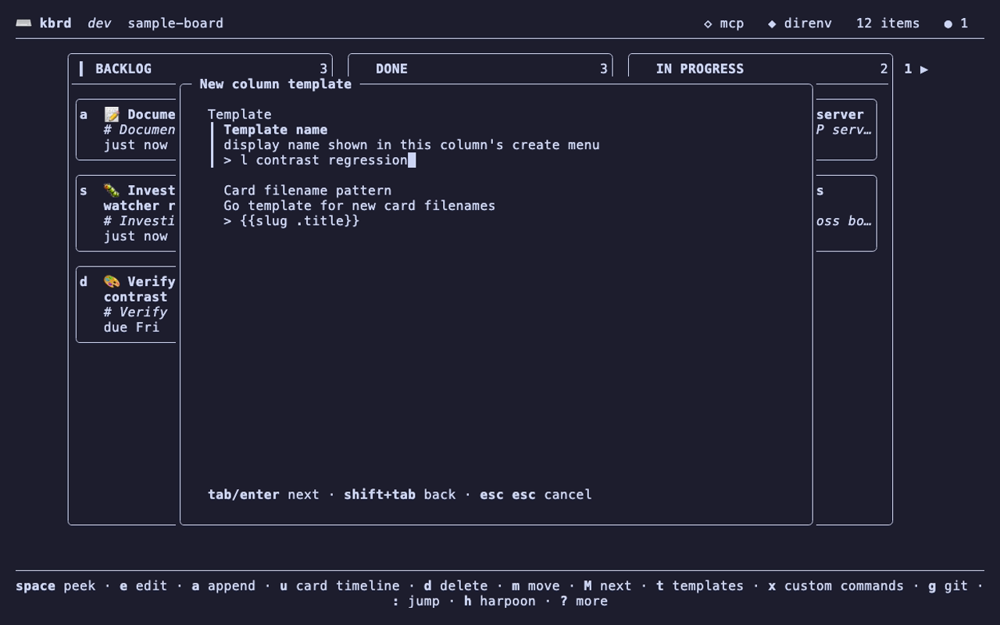
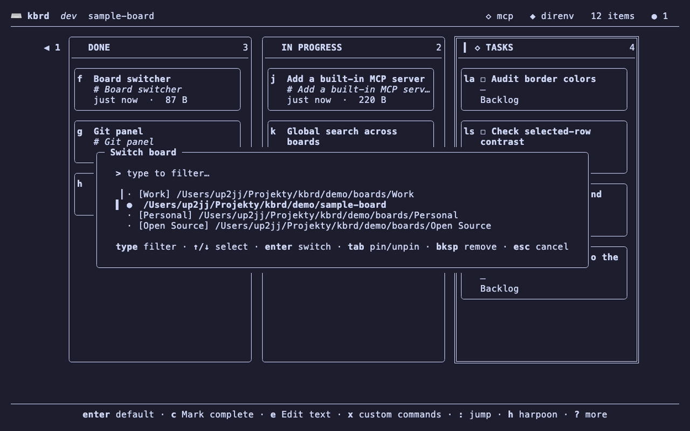
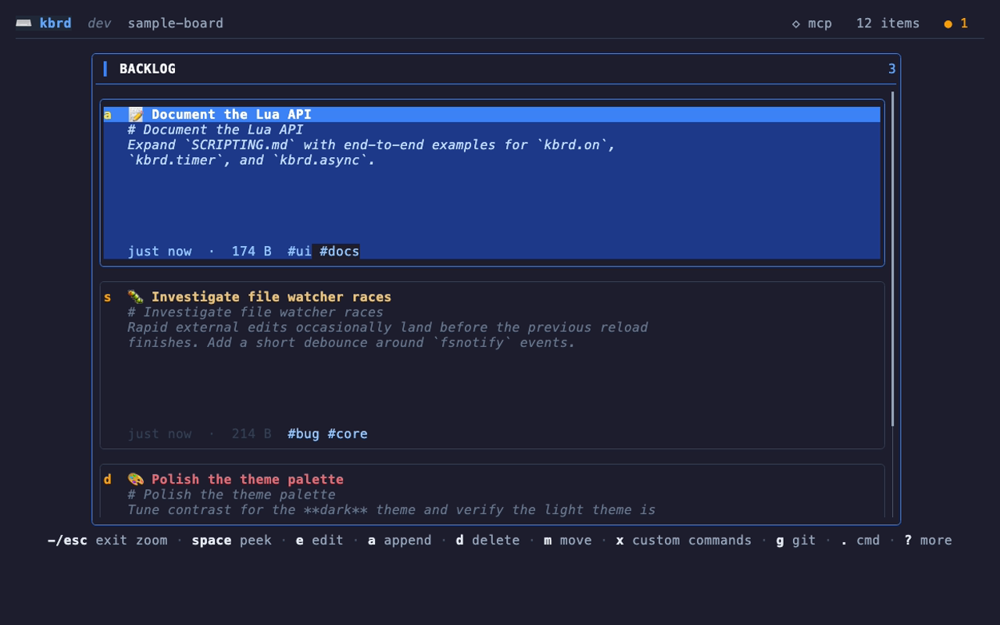
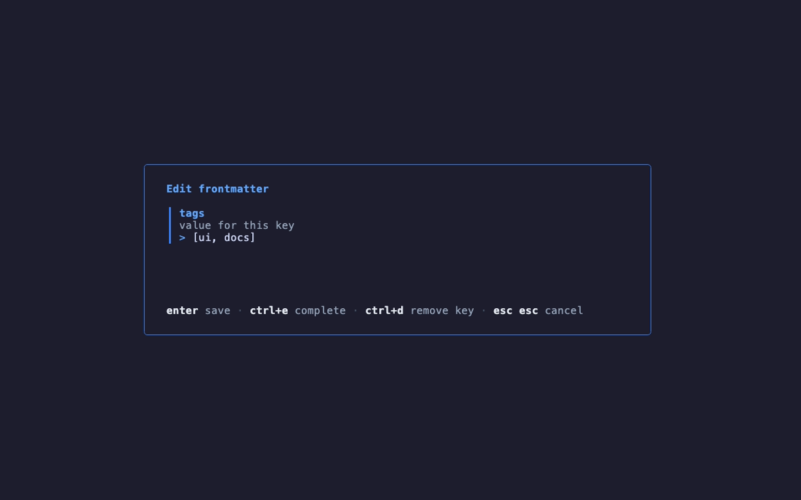
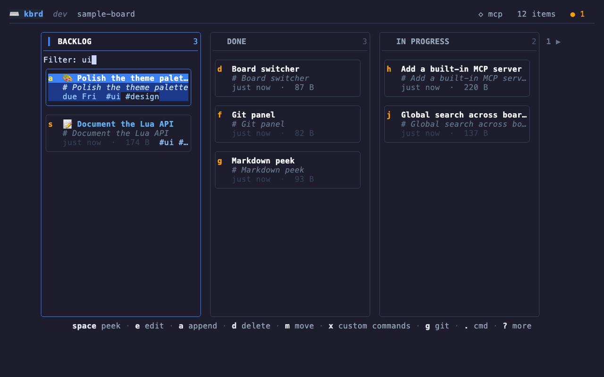

<div align="center">

# kbrd

### A terminal-based, keyboard-driven **Kanban board** for the command line

[](https://go.dev)
[](https://github.com/charmbracelet/bubbletea)
[](./SCRIPTING.md)
[](https://modelcontextprotocol.io)


*Your board is just a folder. Columns are directories. Cards are Markdown files.*

</div>

---

kbrd stores everything as plain files on disk — there is no database and no lock-in. A
**board** is a directory, each **column** is a sub-directory, and each **card** is a
Markdown (`.md`) file. Because the board *is* the filesystem, you can edit it with any
editor, version it with git, sync it with your usual tools, and let kbrd render it as a
live, navigable board.

Built with [Bubble Tea](https://github.com/charmbracelet/bubbletea) and friends, kbrd
adds git integration, fuzzy board switching, cross-board search, an embedded Lua scripting
engine, custom shell commands, and a built-in MCP server for LLM/agent tooling.

<p align="center">
  
</p>

---

## Table of contents

- [Features](#features)
- [Screenshots](#screenshots)
- [Installation](#installation)
- [Getting started](#getting-started)
- [Keyboard shortcuts](#keyboard-shortcuts)
- [Configuration](#configuration)
- [Zellij integration](#zellij-integration)
- [Card templates](#card-templates)
- [Card frontmatter](#card-frontmatter)
- [Extensibility](#extensibility)
  - [Custom shell commands](#custom-shell-commands)
  - [Lua scripting](#lua-scripting)
  - [MCP server](#mcp-server)
  - [Theming](#theming)
- [Web server (headless)](#web-server-headless)
- [Limitations & known gaps](#limitations--known-gaps)
- [Project layout](#project-layout)
- [Development](#development)

---

## Features

A quick, scannable rundown of everything kbrd does:

**Files & storage**

- **Plain-files storage** — directories are columns, `.md` files are cards, zero database.
- **Live reload** — the board updates instantly when files change on disk (`fsnotify`).

**Cards**

- **Create cards** — in the current column (`n`) or the first column (`N`).
- **Card templates** — create pre-structured cards from per-column or board-wide templates through the create menu (`n`); see [TEMPLATES.md](./TEMPLATES.md).
- **Card frontmatter** — YAML metadata on a card sets its accent color, icon, meta line, and filterable `#tags`; custom keys flow into Lua commands as `ctx.data`.
- **Peek** — rendered Markdown preview in a scrollable viewport (`space`).
- **Edit inline** — a modal **vim-like** editor (Normal/Insert/Visual, motions & operators, `:` command-line, surround, markdown list/checkbox helpers, system clipboard, `:lua` eval); press `:help` for the cheatsheet. See [EDITOR.md](./EDITOR.md). Or open in `$EDITOR` (`o`).
- **Append / prepend** — add content to existing cards (`a` / `p`).
- **Journal entries** — append timestamped notes to a card (`b`).
- **Copy / paste** — move text between cards, persists across sessions (`c` / `v`).
- **Pin cards** — float important cards to the top of a column (`!`).
- **Move cards** — to the next column (`m`) or back to the first (`M`).
- **Rename & delete** — cards (`r` / `d`) and columns (`R`), with confirmation on delete.

**Search & navigation**

- **Fully keyboard-driven** — every action has a binding; mouse optional.
- **Global search** — fuzzy full-text search across all recent boards via `ripgrep` (`f`).
- **Board switcher** — fuzzy switch, pin favorites, and remove boards (`Ctrl+P`).
- **Help overlay** — discover every shortcut without leaving the app (`?`).

**Git & sync**

- **Git panel** — diff, commit, log, sync (pull+push), and add remotes in-app (`g`).
- **Auto-sync** — reconciles with the remote when the board opens (and optionally
  on an interval), with automatic upstream setup; it resolves divergence on its
  own, setting aside a conflict copy only when two machines edit the same lines
  (never blocking the sync). A header cell shows the sync state.
- **README generation** — optionally regenerate `README.md` from the board before commits.

**Extensibility**

- **Custom shell commands** — run templated shell commands against any card (`x`).
- **Lua scripting** — extend kbrd with commands, event hooks, timers, and async tasks.
- **Virtual columns** — Lua-driven columns showing a computed view (e.g. open tasks across boards); `tab` switches into them, with script-declared item actions ([example](./examples/tasks/tasks.lua)).
- **Built-in MCP server** — let external tools and LLM agents operate on your boards.

**Interface & integrations**

- **Themes** — toggle light / dark palettes on the fly (quick command `.` → `t`).
- **In-app config menu** — open or scaffold config & command files (`,`).
- **Zellij integration** — inside a [zellij](https://zellij.dev) session, open a card in a floating or tiled editor pane, or a shell scoped to the board (`z`); the tab is named after the board.

---

## Screenshots

<table>
  <tr>
    <td width="50%"></td>
    <td width="50%"></td>
  </tr>
  <tr>
    <td align="center"><em>Peek a card's rendered Markdown (<code>space</code>)</em></td>
    <td align="center"><em>Diff, commit, and sync in the git panel (<code>g</code>)</em></td>
  </tr>
  <tr>
    <td width="50%"></td>
    <td width="50%"></td>
  </tr>
  <tr>
    <td align="center"><em>Fuzzy global search across boards (<code>f</code>)</em></td>
    <td align="center"><em>Switch, pin, and remove boards (<code>Ctrl+P</code>)</em></td>
  </tr>
  <tr>
    <td width="50%"></td>
    <td width="50%"></td>
  </tr>
  <tr>
    <td align="center"><em>Run templated shell commands on a card (<code>x</code>)</em></td>
    <td align="center"><em>Discover every shortcut with the help overlay (<code>?</code>)</em></td>
  </tr>
  <tr>
    <td width="50%"></td>
    <td width="50%"></td>
  </tr>
  <tr>
    <td align="center"><em>Create cards from an empty file or template (<code>n</code>)</em></td>
    <td align="center"><em>Lua-driven virtual columns, e.g. open tasks (<code>tab</code>)</em></td>
  </tr>
  <tr>
    <td width="50%"></td>
    <td width="50%"></td>
  </tr>
  <tr>
    <td align="center"><em>Zoom a single column for focused reading (<code>+</code>)</em></td>
    <td align="center"><em>Edit a card's frontmatter in-app (<code>~</code>)</em></td>
  </tr>
  <tr>
    <td width="50%"></td>
    <td width="50%"></td>
  </tr>
  <tr>
    <td align="center"><em>Filter a column by text or <code>#tag</code> (<code>/</code>)</em></td>
    <td></td>
  </tr>
</table>

---

## Installation

### Homebrew (macOS)

```bash
brew install up2jj/tap/kbrd
```

This installs a prebuilt binary onto your `PATH`. Upgrade later with `brew upgrade kbrd`.

### From source

Requires Go **1.26+**:

```bash
git clone https://github.com/up2jj/kbrd.git
cd kbrd
go build -o kbrd ./
```

Move the resulting `kbrd` binary somewhere on your `PATH`. See [Development](#development) for the test/build workflow.

**Runtime dependencies**
- `git` — for the git panel and sync features.
- Optional: [`ripgrep`](https://github.com/BurntSushi/ripgrep) (`rg`) — required for global search.
- Optional: [`difft`](https://github.com/Wilfred/difftastic) or `diff-so-fancy` — nicer diffs (falls back to `git`).
- Optional: [`zellij`](https://zellij.dev) — enables the `z` actions menu (editor/shell panes) when kbrd runs inside a zellij session.

---

## Getting started

Run kbrd from any directory you want to use as a board:

```bash
./kbrd
```

On first run kbrd sets up default columns. Press `?` at any time for the full shortcut
overlay. To scaffold configuration files:

```bash
./kbrd init            # write a kbrd.toml template into the current directory
./kbrd init --global   # write the global config template to ~/.config/kbrd/
```

**Commands**

| Command | Description |
| --- | --- |
| `kbrd` | Open the current directory as a board (default). |
| `kbrd init [--global]` | Write a config template — local `kbrd.toml` by default, or the global template under `~/.config/kbrd/` with `--global`. |
| `kbrd clone <repo-url> [dir]` | Clone a board repository and open it. `dir` defaults to the repo name; pass `--no-open` to clone without launching the TUI. |
| `kbrd serve eject [--dir]` | Write the default web templates and static assets into `.kbrd_web_templates/` for customizing (see [Web server](#web-server-headless)). |

**Flags**

| Flag | Description |
| --- | --- |
| `--mcp` | Start the built-in MCP server for this run (off by default). |
| `--mcp-addr <addr>` | Override the MCP listen address (default `127.0.0.1:7777`). |
| `--safe` | Disable all board-supplied code — Lua scripting, event hooks, and template `{{shell}}` exec — overriding config. Use when opening a board you don't fully trust. |

---

## Keyboard shortcuts

All bindings below are the defaults from the in-app help (`?`).

### Board view

**Navigation**

| Keys | Action |
| --- | --- |
| `→` / `tab` / `]` | Next column |
| `←` / `shift+tab` / `[` | Previous column |
| `j` / `k` | Move within a column |
| `H` / `L` | Pan columns left / right |
| `/` | Filter cards in the current column |

**Item**

| Keys | Action |
| --- | --- |
| `space` | Peek (rendered Markdown) |
| `e` | Edit |
| `a` / `p` | Append / prepend content |
| `b` | Journal entry |
| `c` / `v` | Copy / paste |
| `o` | Open in `$EDITOR` |
| `!` | Pin / unpin |
| `m` / `M` | Move to next column / first column |
| `r` | Rename item |
| `d` | Delete |
| `x` | Custom commands menu |
| `~` | Edit a frontmatter key/value (`ctrl+e` completes a key, `ctrl+d` removes it) |

**Create & command**

| Keys | Action |
| --- | --- |
| `n` | Create item |
| `N` | New item in first column |
| `.` | Quick command |

**Column**

| Keys | Action |
| --- | --- |
| `R` | Rename column |

**Global**

| Keys | Action |
| --- | --- |
| `F5` | Refresh |
| `Ctrl+P` | Switch board |
| `f` | Search across boards |
| `g` | Git panel |
| `z` | Zellij actions menu (only inside a zellij session) |
| `,` | Config menu |
| `?` | Toggle help |
| `Ctrl+C` | Quit |

### Inline editor (vim-like)

The card editor is a **modal, vim-like** editor: Normal / Insert / Visual modes,
motions and operators, `:` command-line, markdown list/checkbox helpers, system
clipboard, and `:lua` evaluation. Press **`:help`** inside the editor for the full
cheatsheet, or see **[EDITOR.md](./EDITOR.md)**. Set `[editor] vim = false` to fall
back to a plain textarea editor.

| Keys | Action |
| --- | --- |
| `i` `a` `o` / `v` `V` / `:` | Insert / Visual / Command-line |
| `:w` `:q` `:q!` `:wq` · `ctrl+s` | Save / quit (`ctrl+s` saves and stays) |
| `esc` | Back to Normal · close from Normal |
| `:lua <expr>` | Evaluate Lua against the line/selection (see [SCRIPTING.md](./SCRIPTING.md)) |
| `ctrl+t` | Insert `- [ ] `; in Visual/Visual Line mode, prefix selected lines |
| `ctrl+l` | Run a line command · `ctrl+e` expand · `ctrl+v` paste |

> The non-vim fallback (`[editor] vim = false`) uses `ctrl+s`/`enter` to save,
> `ctrl+z`/`ctrl+y` to undo/redo, `ctrl+t` to insert a task, `ctrl+e` to expand,
> and `esc` to cancel.

### Peek

| Keys | Action |
| --- | --- |
| `j` / `k` (`↓` / `↑`) | Scroll down / up |
| `enter` / `space` / `pgdn` | Page down |
| `g` / `home`, `G` / `end` | Top / bottom |
| `q` / `esc` | Close |

### Create menu and template form (`n`)

| Keys | Action |
| --- | --- |
| `↑` / `↓`, `enter` | Pick an empty card or template |
| `/` | Fuzzy-search create options |
| `tab` / `enter` | Next field / step |
| `shift+tab` | Previous field / step |
| `esc` `esc` | Cancel (first `esc` arms, second confirms) |

### Board switcher (`Ctrl+P`)

| Keys | Action |
| --- | --- |
| `↑` / `↓` | Previous / next board |
| `enter` | Switch |
| `tab` | Pin / unpin |
| `esc` / `ctrl+p` | Cancel |

### Global search (`f`)

| Keys | Action |
| --- | --- |
| `↑` / `↓` | Previous / next result |
| `enter` | Open result |
| `esc` | Cancel |

### Git panel (`g`)

| Keys | Action |
| --- | --- |
| `d` | Diff selected file |
| `c` | Commit |
| `s` | Sync (pull + push) |
| `S` | Commit + sync |
| `l` | View log |
| `a` | Add remote |
| `tab` | Toggle pane focus |
| `q` / `esc` | Close |

### Config menu (`,`)

| Keys | Action |
| --- | --- |
| `c` | Open or create local `kbrd.toml` |
| `C` | Open or create global `~/.config/kbrd/config.toml` |
| `x` | Open or create local `.kbrd_commands.yml` |
| `m` | Create local `.mcp.json` |
| `a` | Create local `AGENTS.md` |

### Zellij actions (`z`)

Only available inside a [zellij](https://zellij.dev) session.

| Keys | Action |
| --- | --- |
| `f` | Open the card in a floating editor pane |
| `e` | Open the card in a new tiled pane |
| `s` | Open a shell in the board directory |
| `q` / `esc` | Close |

---

## Configuration

kbrd reads two TOML files, with the folder-local one overriding the global one:

- **Global:** `~/.config/kbrd/config.toml`
- **Folder-local:** `<board>/kbrd.toml`

Generate templates with `kbrd init` / `kbrd init --global`, or from the config menu (`,`).

```toml
[display]
column_width  = 32          # width of each column
preview_lines = 3           # lines shown in a card preview
title_from_heading = false  # use the first "# " heading as the card title
theme         = "dark"      # "light" | "dark"

[notify]
backend = "auto"            # auto | osascript | osc9 | osc777 | none

[board]
name = ""                   # optional label shown in the board switcher

[git]
diff_tool          = "auto"     # auto | difft | diff-so-fancy | git
auto_sync_interval = ""         # empty / "0" disables; e.g. "30s", "5m", "1h"
generate_readme    = false      # regenerate README.md from the board before each commit
manual_sync_mode   = "attended" # attended (ff-only, fail loud) | auto (merge + conflict copy)
sync_on_startup    = true       # reconcile with the remote when the board opens (no-op without a remote)
auto_commit        = false      # TUI: commit pending edits before auto-sync (pauses while editor is open)

[scripting]
enabled            = true     # master switch for the Lua VM
command_timeout_ms = 2000     # timeout for command callbacks
hook_timeout_ms    = 500      # timeout for event hooks and timers
instruction_limit  = 10000000 # CPU backstop per script run
error_threshold    = 3        # auto-disable a failing hook/timer after N errors (0 = never)

[mcp]
enabled = false             # built-in MCP server; off by default (start with --mcp or enabled = true)
addr    = "127.0.0.1:7777"  # Streamable HTTP listen address
```

---

## Zellij integration

When kbrd detects it is running inside a [zellij](https://zellij.dev) session (via the
`ZELLIJ` environment variable), it names the current tab after the board on startup and
adds a **`z` actions menu** so you can jump into a card without leaving the board:

| Key | Action |
| --- | --- |
| `f` | Open the card in a **floating** editor pane |
| `e` | Open the card in a new **tiled** pane |
| `s` | Open a **shell** in the board directory |

Editor panes use `$VISUAL` → `$EDITOR` → `vi`. Reopening a card you already have open
**focuses the existing pane** instead of spawning a duplicate. The `z` binding and its
help entry appear only inside zellij; everywhere else it does nothing. Outside zellij, use
`o` to open a card in your `$EDITOR` as usual.

### Extending zellij usage with custom commands

The built-in menu covers the common cases; for anything else, kbrd's
[custom shell commands](#custom-shell-commands) already give you the whole zellij CLI.
Because commands run inside the session with the board
[template variables](#custom-shell-commands), you can script any pane / tab / layout
behavior and run it from the `x` menu — no kbrd config required:

```yaml
commands:
  - name: Edit in big floating pane
    id: zellij-edit-big
    command: zellij edit -f --width 80% --height 80% --cwd "{{.boardPath}}" "{{.filePath}}"

  - name: Lazygit in the card's column
    id: zellij-lazygit
    command: zellij run --cwd "{{.columnPath}}" -- lazygit

  - name: Tail the card's log
    id: zellij-tail-log
    command: zellij run --name logs -- tail -f "{{.fileDir}}/run.log"
```

---

## Card templates

Press `n` in a column to open the create menu: start an empty Markdown card, or
choose from column-level and board-level templates. A template is a Markdown file
whose YAML frontmatter declares a multi-step form (text inputs, selects,
multi-selects, confirms — rendered with
[huh](https://github.com/charmbracelet/huh)); the body is a Go `text/template` that
receives your answers plus the standard board variables.

```markdown
---
name: Task
filename: "{{slug .title}}"
steps:
  - title: Task
    fields:
      - {key: title, type: input, title: Title, required: true}
      - {key: priority, type: select, title: Priority, options: [low, normal, high], default: normal}
---
# {{.title}}

- Priority: {{.priority}}
```

Templates live in `<board>/.kbrd_templates/` (every column) and
`<board>/<column>/.kbrd_templates/` (column-only; shadows board templates with the same
name). Created cards fire the normal `item_created` event, so hooks apply.

Template bodies and filenames can resolve natural-language dates with
`{{date "next friday"}}` / `{{date "za 2 tygodnie"}}` — English and Polish, with an
optional Go layout. The same `date` function is available in custom commands, hooks,
and Lua (`kbrd.date.parse`).

See **[TEMPLATES.md](./TEMPLATES.md)** for the full format reference and
[`examples/templates/`](./examples/templates/) for worked examples.

---

## Card frontmatter

A card may open with a YAML frontmatter block; kbrd parses it for display
metadata and keeps it out of the card preview:

```markdown
---
accent: "#e06c75"       # color for the card title
icon: "🔥"              # glyph shown before the title
meta: due tomorrow      # replaces the modified/size/git meta line
tags: [urgent, backend] # rendered as #tag chips; matched by the column filter
assignee: kuba          # custom keys are allowed
---
# Card title
Body text…
```

All keys are optional and parsing is always on. `tags` accepts a list or a
single string, and tag names participate in the column filter (`/`). The full
frontmatter map — including custom keys like `assignee` — is exposed to Lua
custom commands as `ctx.data`, so scripts can act on it. Malformed YAML never
breaks a card: it loads without metadata and shows a `⚠ yaml` badge on its
meta line so the mistake is visible.

Press `~` on a card to edit a single key without leaving the board: type the
key (`ctrl+e` completes one already used anywhere on the board), then edit its
value — pre-filled with the card's current value when the key exists, with
`ctrl+e` completing common scalars like `true`/`false`/`yes`/`no` — or press
`ctrl+d` to remove the key. A `frontmatter_suggestions` Lua hook can add its own
keys and default values to the completion list (see [SCRIPTING.md](./SCRIPTING.md)).

---

## Extensibility

kbrd is extensible at three levels: simple **shell commands**, full **Lua scripting**, and
an **MCP server** for external tools.

> **⚠️ Security:** A board is just a folder, and opening one **runs any folder-local
> `.kbrd.lua` and `.kbrd_commands.yml` it contains** — automatically, with no prompt.
> Cloning or syncing a board authored by someone else executes their code with your
> privileges. Only open boards you trust, or disable scripting for untrusted ones. See
> **[SECURITY.md](./SECURITY.md)** for the trust model and mitigations.

### Custom shell commands

Define shell commands that run against the selected card, column, or board. Press `x` on a
card to open the menu and fuzzy-search by name ([example](./examples/commands/commands.yml)).

- **Global:** `~/.config/kbrd/commands.yml`
- **Folder-local:** `<board>/.kbrd_commands.yml` (overrides global commands with the same `id`)

```yaml
commands:
  - name: Edit in vim
    id: edit-vim
    description: Open file in vim
    command: vim "{{.filePath}}"

  - name: Reveal in Finder
    id: reveal-finder
    description: Open the column folder in Finder
    command: open "{{.columnPath}}"
```

**Template variables**

| Variable | Meaning |
| --- | --- |
| `{{.filePath}}` | Absolute path to the selected file |
| `{{.fileName}}` | Base name without `.md` |
| `{{.fileDir}}` | Directory containing the file |
| `{{.boardPath}}` | Board root path |
| `{{.boardName}}` | Board name from config |
| `{{.columnPath}}` | Column folder path |
| `{{.columnName}}` | Column folder name |
| `{{env "VAR"}}` | Value of environment variable `VAR` (empty string if unset) |

Quote variables to handle paths with spaces. Reload by re-opening the board.

The rendered command also runs in a shell, so plain `$VAR` works too — use `{{env "VAR"}}` only
when you need kbrd to substitute the value *before* the shell sees it (e.g. to build the command
itself rather than have the shell expand it).

### Lua scripting

kbrd embeds a Lua 5.1 VM ([gopher-lua](https://github.com/yuin/gopher-lua)). Scripts are
loaded at startup from:

- **Global:** `~/.config/kbrd/init.lua`
- **Folder-local:** `<board>/.kbrd.lua`

The API surface includes:

- `kbrd.command(...)` — register a custom command (appears in the `x` menu; shadows a shell command with the same id).
- `kbrd.on(event, fn)` — hook lifecycle events (`board_load`, `board_refresh`, `item_select`, `column_change`, `item_open`, `item_saved`, `item_changed`, `item_created`, `item_renamed`, `item_deleted`, `item_moved`, `git_sync_done`), plus the `column_items` transform hook to sort/filter/group a column's cards (e.g. by a `priority` frontmatter key), and the serve-only `http_request`/`http_response` middleware hooks to gate, redirect, or rewrite web requests.
- `kbrd.board.move / create / rename / delete / refresh / createColumn` — board operations.
- `kbrd.board.templates / createFromTemplate` — list card templates and create cards from them ([TEMPLATES.md](./TEMPLATES.md)).
- `kbrd.ui.pick / prompt / confirm` — interactive dialogs (commands only, not hooks/timers).
- `kbrd.fs.read / write / exists / mkdir / glob` — filesystem helpers (paths resolve against the board root).
- `kbrd.async.run / cancel` — run shell commands on a worker goroutine.
- `kbrd.timer.every / after / cancel` — schedule recurring or one-shot callbacks.
- `kbrd.notify(msg, level)` / `kbrd.status(...)` — toasts and status line.

Scripting can be disabled and tuned via the `[scripting]` config section. See
**[SCRIPTING.md](./SCRIPTING.md)** for the full API reference, examples, and safety model.

### MCP server

kbrd can run a built-in [Model Context Protocol](https://modelcontextprotocol.io) server over
Streamable HTTP, letting external tools and LLM agents operate on your boards headlessly.
It is **off by default** — start it with `--mcp` for a single run, or set `enabled = true` in
the `[mcp]` config section to opt a board in permanently. It listens on `127.0.0.1:7777`
(override with `--mcp-addr` or `[mcp].addr`). The header strip shows its state: `◆ mcp`
(green) when running, `✕ mcp` (red) when it was requested but couldn't bind — e.g. the port
is already in use — and `◇ mcp` (muted) when off. Its scope covers boards in your recents
plus any folder-local `.mcp.json`.

**Tools exposed**

| Tool | Purpose |
| --- | --- |
| `list_boards` | List known boards and their friendly names |
| `list_folders` | List the columns in a board |
| `list_files` | List the cards in a column |
| `add_file_to_board` | Create a card in a board/column, with optional content |
| `list_custom_commands` | List available shell custom commands |
| `run_custom_command` | Run a shell custom command with full context |

Create a local `AGENTS.md` (config menu → `a`) to give agents orientation about a board,
and a local `.mcp.json` (config menu → `m`) for per-board MCP configuration. Note that a
folder-local `.mcp.json` can point the MCP server at external processes, so it carries the
same trust caveat as folder-local scripts — see **[SECURITY.md](./SECURITY.md)**.

> Note: the MCP server sees **shell** custom commands only — Lua-registered commands are
> not visible to or runnable via MCP.

### Theming

Toggle between light and dark palettes with `t`, or set a default with `display.theme`.

---

## Web server (headless)

`kbrd serve` runs the board as a mobile-first web app — no TUI, no JavaScript build step
(plain HTML + [htmx](https://htmx.org), vendored). View columns and cards; create, edit,
and delete cards from a phone. **Every mutation becomes a git commit and is pushed
immediately**, so the git remote stays the source of truth and the server is disposable.

```bash
# Local: plain HTTP on :8080 (no TLS, no git remote needed — "no sync" banner)
KBRD_TOKEN=$(openssl rand -base64 24) kbrd serve --dir ~/boards/work
```

Dockerized — clones the board repo on first boot, serves it over Let's Encrypt TLS:

```bash
cp .env.example .env   # set KBRD_TOKEN, GIT_TOKEN, KBRD_DOMAIN, and the GIT_URL repo
docker compose up -d
```

Flags / env (flag wins): `--addr`/`KBRD_ADDR` (default `:8080`), `--domain`/`KBRD_DOMAIN`
(enables Let's Encrypt on `:443`+`:80`; needs public reachability under that domain),
`--token`/`KBRD_TOKEN` (required, ≥12 chars), `--git-url`/`GIT_URL` (clone when `--dir` is
missing/empty), `--pull-interval`/`KBRD_PULL_INTERVAL` (default `60s`, `0` disables).
Commit author comes from `GIT_AUTHOR_NAME`/`GIT_AUTHOR_EMAIL`.

Security notes:

- The web token and the git credential are **separate secrets**; use a fine-grained PAT
  scoped to the single board repo (contents read/write) embedded in `GIT_URL`.
- Login is a single shared token behind a rate limiter; sessions are HMAC cookies that
  all invalidate on restart. For LAN/Tailscale-only use, omit `--domain` and terminate
  TLS yourself (e.g. `tailscale serve`).
- Web mode is **safe by default**: folder-local Lua, hooks, and template exec do not
  run, so serving an untrusted board cannot execute its code. The one opt-in is
  `serve --scripting`, which runs the board's `init.lua`/`.kbrd.lua` — its timers and
  the `http_request`/`http_response` request-middleware hooks (custom auth, redirects,
  header/response rewriting). Enable it only for boards you trust.

Conflict stance: each mutation commits locally first, then pushes. When the push is
rejected (the remote moved ahead) the server reconciles with `fetch → merge → push` —
no rebase, no force. Non-overlapping edits to a card auto-merge; a *true* line conflict
keeps your local version as the card and writes the incoming version to a sibling
`<card> (conflict <name|timestamp>).md`, so sync never halts and nothing is lost — the
set-aside edit propagates back to every machine on the next push. All **automatic**
flows (the web daemon and the TUI auto-sync) self-heal this way; the **manual** TUI sync
follows `git.manual_sync_mode` (`attended` fails loud on divergence, `auto` reconciles
like the rest). The TUI auto-sync pauses while the in-app editor is open, and otherwise
only runs on a clean tree (a merge can't run over uncommitted edits); set
`git.auto_commit = true` to have it commit pending edits first on later ticks. Edits
carry a content hash, so a card changed upstream mid-edit is flagged instead of
silently overwritten.

### Customizing the web UI

The HTML templates and static assets (`style.css`, the vendored htmx) are baked into the
binary, but a `.kbrd_web_templates/` folder inside the board **overrides them
file-by-file**, mirroring the embedded layout:

```
<board>/.kbrd_web_templates/
  templates/   *.html — shadow the embedded template of the same name
  static/      style.css, htmx.min.js, or any new file
```

Scaffold the defaults to edit from with:

```bash
kbrd serve eject --dir ~/boards/work   # writes .kbrd_web_templates/ (never clobbers existing files)
```

Overrides **hot-reload on save** — a saved template re-parses live (a syntax error is
logged and the last-good markup keeps serving), and static files are read straight from
disk. The folder is committed and pulled with the board like any other content. Note the
Content-Security-Policy is `default-src 'self'`, so custom styles must be served from
`static/` (or inlined) — external stylesheet/script URLs are blocked.

---

## Limitations & known gaps

- Several scripting helpers are **planned but not yet available**: synchronous shell
  capture (`kbrd.shell.run/exec`), `kbrd.git.*`, `kbrd.log.*`, `kbrd.config.get/all`,
  `kbrd.inspect`, bundled `require("json"|"re"|"http")`, and a `lua/?.lua` `require` path.
- The `git_post_commit` event is reserved but not yet emitted.
- `kbrd.ui.*` dialogs cannot be called from hooks or timers (no coroutine context), and
  new commands/hooks/timers cannot be registered from inside a timer callback or hook.
- The MCP server cannot run Lua-registered commands — only shell custom commands.
- Global search requires `ripgrep` to be installed.

---

## Project layout

| Directory | Role |
| --- | --- |
| `commands/` | CLI command tree (cobra): root/default, `init`, `clone`, `serve` (+ `eject`), and their run logic |
| `board/` | Headless board semantics: discovery, column/item enumeration, name sanitizing |
| `template/` | Card templates: discovery, frontmatter schema, validation, rendering |
| `config/` | TOML config + custom-command loading and templates |
| `events/` | Event bus that feeds the scripting hooks |
| `fs/` | Filesystem and git CLI helpers, plus the file watcher |
| `mcp/` | MCP server: protocol, tools, command bridge, agents template |
| `web/` | Headless web frontend (`kbrd serve`): handlers, templates, auth, git sync |
| `model/` | The Bubble Tea TUI — board state, dialogs, git panel, search, switcher, theming, keys |
| `recents/` | Persisted list of recent/pinned boards |
| `script/` | Lua VM host and the `kbrd.*` API bindings |
| `main.go` | Entry point — calls `commands.NewRootCmd().Execute()` |

---

## Development

```bash
go build -o kbrd ./   # build
go test ./...         # run the test suite
```

Common tasks are wrapped in a [`justfile`](justfile) (install with `brew install just`):

```bash
just              # list all recipes
just build        # build ./kbrd
just test         # run the test suite
just hooks        # install git hooks via prek
just snapshot     # build a local release into ./dist (no publish)
just check        # validate the GoReleaser config
just release 0.2.0  # tag v0.2.0 and push, triggering the release workflow
```

Git hooks are managed with [prek](https://prek.j178.dev) (`brew install prek`), configured in
[`prek.toml`](prek.toml). Install them once with `just hooks` — commits then run gofmt, go vet,
a `go mod tidy` check, and file hygiene checks; pushes additionally run the full test suite.
Run all hooks manually with `prek run --all-files`.

Releases are automated with [GoReleaser](https://goreleaser.com) (see [`.goreleaser.yaml`](.goreleaser.yaml)).
Pushing a `v*` tag runs `.github/workflows/release.yml`, which builds the macOS binaries,
publishes a GitHub Release, and updates the Homebrew cask in `up2jj/homebrew-tap`.

The CLI command tree lives in `commands/` (one file per command), the TUI in `model/`,
keybindings are declared in `model/keys.go`, configuration in `config/`, and the Lua API
in `script/` (documented in `SCRIPTING.md`).
