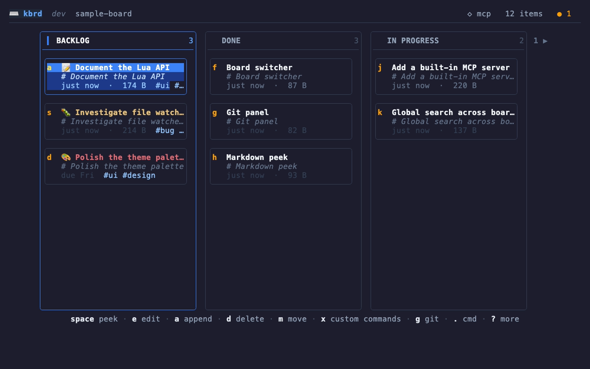
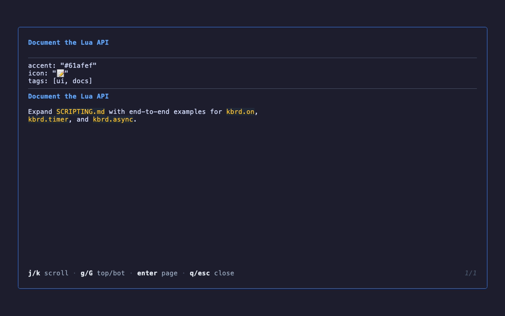
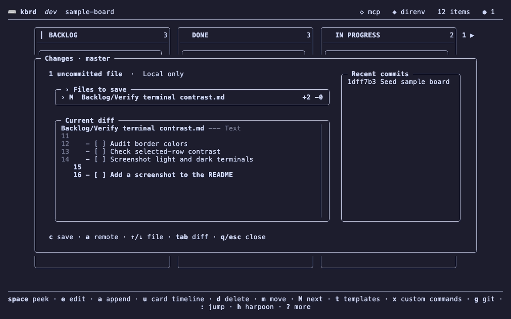
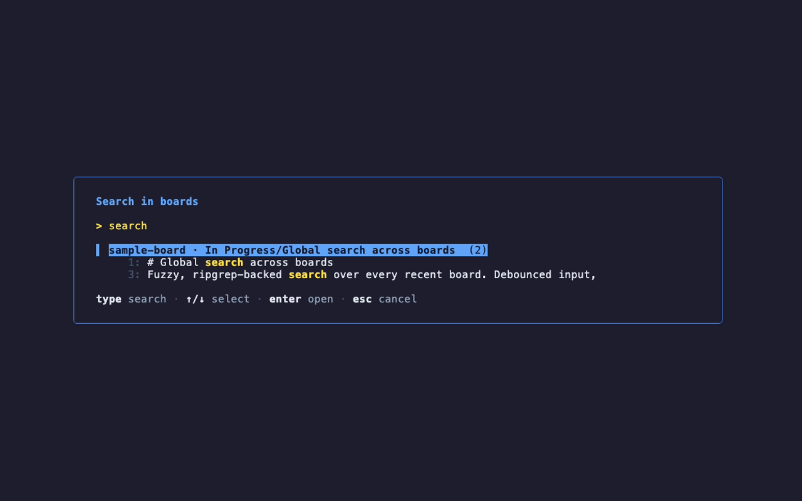
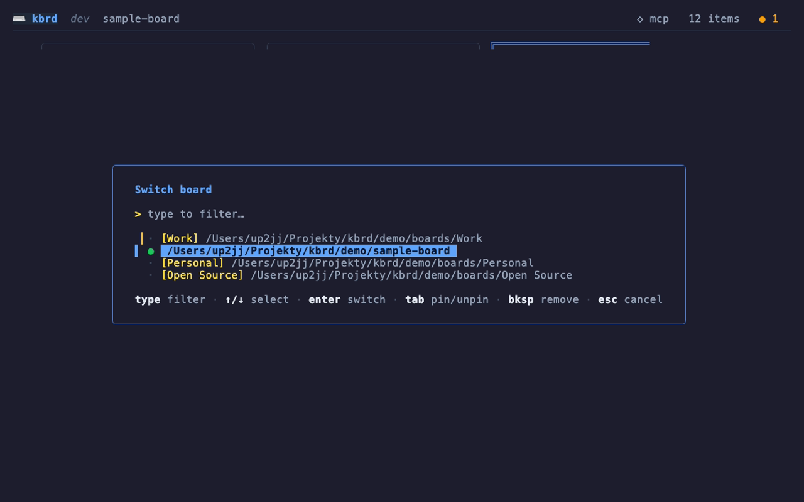
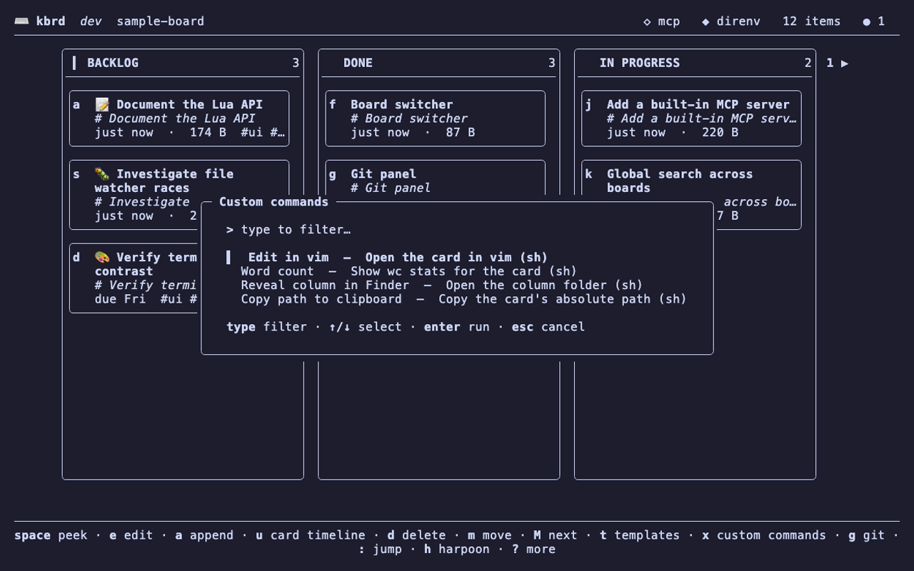
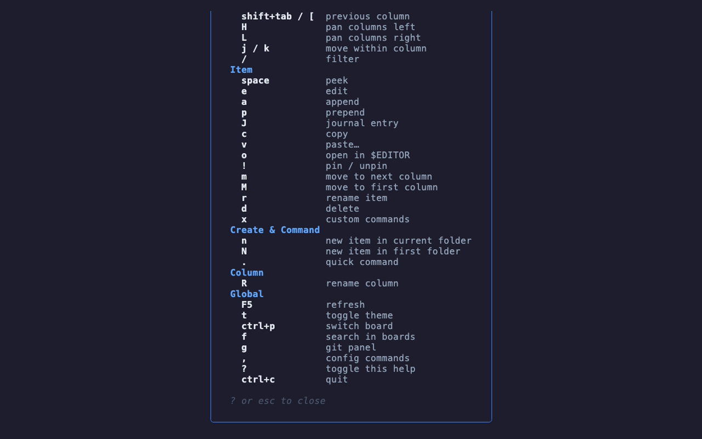

<div align="center">

# kbrd

### A terminal-based, keyboard-driven **Kanban board** for the command line

[](https://go.dev)
[](https://github.com/charmbracelet/bubbletea)
[](./SCRIPTING.md)
[](https://modelcontextprotocol.io)


*Your board is just a folder. Columns are directories. Cards are Markdown files.*

</div>

---

kbrd stores everything as plain files on disk — there is no database and no lock-in. A
**board** is a directory, each **column** is a sub-directory, and each **card** is a
Markdown (`.md`) file. Because the board *is* the filesystem, you can edit it with any
editor, version it with git, sync it with your usual tools, and let kbrd render it as a
live, navigable board.

Built with [Bubble Tea](https://github.com/charmbracelet/bubbletea) and friends, kbrd
adds git integration, fuzzy board switching, cross-board search, an embedded Lua scripting
engine, custom shell commands, and a built-in MCP server for LLM/agent tooling.

<p align="center">
  
</p>

---

## Table of contents

- [Features](#features)
- [Screenshots](#screenshots)
- [Installation](#installation)
- [Getting started](#getting-started)
- [Keyboard shortcuts](#keyboard-shortcuts)
- [Configuration](#configuration)
- [Extensibility](#extensibility)
  - [Custom shell commands](#custom-shell-commands)
  - [Lua scripting](#lua-scripting)
  - [MCP server](#mcp-server)
  - [Theming](#theming)
- [Limitations & known gaps](#limitations--known-gaps)
- [Project layout](#project-layout)
- [Development](#development)

---

## Features

A quick, scannable rundown of everything kbrd does:

- **Plain-files storage** — directories are columns, `.md` files are cards, zero database.
- **Live reload** — the board updates instantly when files change on disk (`fsnotify`).
- **Fully keyboard-driven** — every action has a binding; mouse optional.
- **Create cards** — in the current column (`n`) or the first column (`N`).
- **Peek** — rendered Markdown preview in a scrollable viewport (`space`).
- **Edit inline** — with undo/redo and an expand toggle, or open in `$EDITOR` (`o`).
- **Append / prepend** — add content to existing cards (`a` / `p`).
- **Journal entries** — append timestamped notes to a card (`J`).
- **Copy / paste** — move text between cards, persists across sessions (`c` / `v`).
- **Pin cards** — float important cards to the top of a column (`!`).
- **Move cards** — to the next column (`m`) or back to the first (`M`).
- **Rename & delete** — cards (`r` / `d`) and columns (`R`), with confirmation on delete.
- **Global search** — fuzzy full-text search across all recent boards via `ripgrep` (`f`).
- **Board switcher** — fuzzy switch, pin favorites, and remove boards (`Ctrl+P`).
- **Git panel** — diff, commit, log, sync (pull+push), and add remotes in-app (`g`).
- **Auto-sync** — optional periodic pull/push with automatic upstream setup.
- **README generation** — optionally regenerate `README.md` from the board before commits.
- **Themes** — toggle light / dark palettes on the fly (`t`).
- **Help overlay** — discover every shortcut without leaving the app (`?`).
- **In-app config menu** — open or scaffold config & command files (`,`).
- **Custom shell commands** — run templated shell commands against any card (`x`).
- **Lua scripting** — extend kbrd with commands, event hooks, timers, and async tasks.
- **Built-in MCP server** — let external tools and LLM agents operate on your boards.

---

## Screenshots

<table>
  <tr>
    <td width="50%"></td>
    <td width="50%"></td>
  </tr>
  <tr>
    <td align="center"><em>Peek a card's rendered Markdown (<code>space</code>)</em></td>
    <td align="center"><em>Diff, commit, and sync in the git panel (<code>g</code>)</em></td>
  </tr>
  <tr>
    <td width="50%"></td>
    <td width="50%"></td>
  </tr>
  <tr>
    <td align="center"><em>Fuzzy global search across boards (<code>f</code>)</em></td>
    <td align="center"><em>Switch, pin, and remove boards (<code>Ctrl+P</code>)</em></td>
  </tr>
  <tr>
    <td width="50%"></td>
    <td width="50%"></td>
  </tr>
  <tr>
    <td align="center"><em>Run templated shell commands on a card (<code>x</code>)</em></td>
    <td align="center"><em>Discover every shortcut with the help overlay (<code>?</code>)</em></td>
  </tr>
</table>

---

## Installation

### Homebrew (macOS)

```bash
brew install up2jj/tap/kbrd
```

This installs a prebuilt binary onto your `PATH`. Upgrade later with `brew upgrade kbrd`.

### From source

Requires Go **1.26+**:

```bash
git clone https://github.com/up2jj/kbrd.git
cd kbrd
go build -o kbrd ./
```

Move the resulting `kbrd` binary somewhere on your `PATH`. See [Development](#development) for the test/build workflow.

**Runtime dependencies**
- `git` — for the git panel and sync features.
- Optional: [`ripgrep`](https://github.com/BurntSushi/ripgrep) (`rg`) — required for global search.
- Optional: [`difft`](https://github.com/Wilfred/difftastic) or `diff-so-fancy` — nicer diffs (falls back to `git`).

---

## Getting started

Run kbrd from any directory you want to use as a board:

```bash
./kbrd
```

On first run kbrd sets up default columns. Press `?` at any time for the full shortcut
overlay. To scaffold configuration files:

```bash
./kbrd --init-config         # write the global config template to ~/.config/kbrd/
./kbrd --init-local-config   # write a kbrd.toml template into the current directory
```

**Command-line flags**

| Flag | Description |
| --- | --- |
| `--init-config` | Write the global config template to `~/.config/kbrd/` and exit. |
| `--init-local-config` | Write a `kbrd.toml` template into the current directory and exit. |
| `--no-mcp` | Disable the built-in MCP server for this run. |
| `--mcp-addr <addr>` | Override the MCP listen address (default `127.0.0.1:7777`). |

---

## Keyboard shortcuts

All bindings below are the defaults from the in-app help (`?`).

### Board view

**Navigation**

| Keys | Action |
| --- | --- |
| `tab` / `]` | Next column |
| `shift+tab` / `[` | Previous column |
| `j` / `k` | Move within a column |
| `H` / `L` | Pan columns left / right |
| `/` | Filter cards in the current column |

**Item**

| Keys | Action |
| --- | --- |
| `space` | Peek (rendered Markdown) |
| `e` | Edit |
| `a` / `p` | Append / prepend content |
| `J` | Journal entry |
| `c` / `v` | Copy / paste |
| `o` | Open in `$EDITOR` |
| `!` | Pin / unpin |
| `m` / `M` | Move to next column / first column |
| `r` | Rename item |
| `d` | Delete |
| `x` | Custom commands menu |

**Create & command**

| Keys | Action |
| --- | --- |
| `n` | New item in current column |
| `N` | New item in first column |
| `.` | Quick command |

**Column**

| Keys | Action |
| --- | --- |
| `R` | Rename column |

**Global**

| Keys | Action |
| --- | --- |
| `F5` | Refresh |
| `t` | Toggle theme |
| `Ctrl+P` | Switch board |
| `f` | Search across boards |
| `g` | Git panel |
| `,` | Config menu |
| `?` | Toggle help |
| `Ctrl+C` | Quit |

### Inline editor

| Keys | Action |
| --- | --- |
| `ctrl+s` / `enter` | Save / confirm |
| `ctrl+z` / `ctrl+y` | Undo / redo |
| `ctrl+e` | Toggle expanded view |
| `esc` | Cancel |

### Peek

| Keys | Action |
| --- | --- |
| `j` / `k` (`↓` / `↑`) | Scroll down / up |
| `enter` / `space` / `pgdn` | Page down |
| `g` / `home`, `G` / `end` | Top / bottom |
| `q` / `esc` | Close |

### Board switcher (`Ctrl+P`)

| Keys | Action |
| --- | --- |
| `↑` / `↓` | Previous / next board |
| `enter` | Switch |
| `tab` | Pin / unpin |
| `esc` / `ctrl+p` | Cancel |

### Global search (`f`)

| Keys | Action |
| --- | --- |
| `↑` / `↓` | Previous / next result |
| `enter` | Open result |
| `esc` | Cancel |

### Git panel (`g`)

| Keys | Action |
| --- | --- |
| `d` | Diff selected file |
| `c` | Commit |
| `s` | Sync (pull + push) |
| `S` | Commit + sync |
| `l` | View log |
| `a` | Add remote |
| `tab` | Toggle pane focus |
| `q` / `esc` | Close |

### Config menu (`,`)

| Keys | Action |
| --- | --- |
| `c` | Open or create local `kbrd.toml` |
| `C` | Open or create global `~/.config/kbrd/config.toml` |
| `x` | Open or create local `.kbrd_commands.yml` |
| `m` | Create local `.mcp.json` |
| `a` | Create local `AGENTS.md` |

---

## Configuration

kbrd reads two TOML files, with the folder-local one overriding the global one:

- **Global:** `~/.config/kbrd/config.toml`
- **Folder-local:** `<board>/kbrd.toml`

Generate templates with `--init-config` / `--init-local-config`, or from the config menu (`,`).

```toml
[display]
column_width  = 32          # width of each column
preview_lines = 3           # lines shown in a card preview
title_from_heading = false  # use the first "# " heading as the card title
theme         = "dark"      # "light" | "dark"

[notify]
backend = "auto"            # auto | osascript | osc9 | osc777 | none

[board]
name = ""                   # optional label shown in the board switcher

[git]
diff_tool          = "auto" # auto | difft | diff-so-fancy | git
auto_sync_interval = ""     # empty / "0" disables; e.g. "30s", "5m", "1h"
generate_readme    = false  # regenerate README.md from the board before each commit

[scripting]
enabled            = true     # master switch for the Lua VM
command_timeout_ms = 2000     # timeout for command callbacks
hook_timeout_ms    = 500      # timeout for event hooks and timers
instruction_limit  = 10000000 # CPU backstop per script run
error_threshold    = 3        # auto-disable a failing hook/timer after N errors (0 = never)

[mcp]
enabled = true              # built-in MCP server (also disable with --no-mcp)
addr    = "127.0.0.1:7777"  # Streamable HTTP listen address
```

---

## Extensibility

kbrd is extensible at three levels: simple **shell commands**, full **Lua scripting**, and
an **MCP server** for external tools.

> **⚠️ Security:** A board is just a folder, and opening one **runs any folder-local
> `.kbrd.lua` and `.kbrd_commands.yml` it contains** — automatically, with no prompt.
> Cloning or syncing a board authored by someone else executes their code with your
> privileges. Only open boards you trust, or disable scripting for untrusted ones. See
> **[SECURITY.md](./SECURITY.md)** for the trust model and mitigations.

### Custom shell commands

Define shell commands that run against the selected card, column, or board. Press `x` on a
card to open the menu and fuzzy-search by name.

- **Global:** `~/.config/kbrd/commands.yml`
- **Folder-local:** `<board>/.kbrd_commands.yml` (overrides global commands with the same `id`)

```yaml
commands:
  - name: Edit in vim
    id: edit-vim
    description: Open file in vim
    command: vim "{{.filePath}}"

  - name: Reveal in Finder
    id: reveal-finder
    description: Open the column folder in Finder
    command: open "{{.columnPath}}"
```

**Template variables**

| Variable | Meaning |
| --- | --- |
| `{{.filePath}}` | Absolute path to the selected file |
| `{{.fileName}}` | Base name without `.md` |
| `{{.fileDir}}` | Directory containing the file |
| `{{.boardPath}}` | Board root path |
| `{{.boardName}}` | Board name from config |
| `{{.columnPath}}` | Column folder path |
| `{{.columnName}}` | Column folder name |
| `{{env "VAR"}}` | Value of environment variable `VAR` (empty string if unset) |

Quote variables to handle paths with spaces. Reload by re-opening the board.

The rendered command also runs in a shell, so plain `$VAR` works too — use `{{env "VAR"}}` only
when you need kbrd to substitute the value *before* the shell sees it (e.g. to build the command
itself rather than have the shell expand it).

### Lua scripting

kbrd embeds a Lua 5.1 VM ([gopher-lua](https://github.com/yuin/gopher-lua)). Scripts are
loaded at startup from:

- **Global:** `~/.config/kbrd/init.lua`
- **Folder-local:** `<board>/.kbrd.lua`

The API surface includes:

- `kbrd.command(...)` — register a custom command (appears in the `x` menu; shadows a shell command with the same id).
- `kbrd.on(event, fn)` — hook lifecycle events (`board_load`, `board_refresh`, `item_select`, `column_change`, `item_open`, `item_created`, `item_renamed`, `item_deleted`, `item_moved`, `git_sync_done`).
- `kbrd.board.move / refresh / createColumn` — board operations.
- `kbrd.ui.pick / prompt / confirm` — interactive dialogs (commands only, not hooks/timers).
- `kbrd.fs.read / write / exists / mkdir / glob` — filesystem helpers (paths resolve against the board root).
- `kbrd.async.run / cancel` — run shell commands on a worker goroutine.
- `kbrd.timer.every / after / cancel` — schedule recurring or one-shot callbacks.
- `kbrd.notify(msg, level)` / `kbrd.status(...)` — toasts and status line.

Scripting can be disabled and tuned via the `[scripting]` config section. See
**[SCRIPTING.md](./SCRIPTING.md)** for the full API reference, examples, and safety model.

### MCP server

kbrd runs a built-in [Model Context Protocol](https://modelcontextprotocol.io) server over
Streamable HTTP, letting external tools and LLM agents operate on your boards headlessly.
It listens on `127.0.0.1:7777` by default (configure via `[mcp]` or `--mcp-addr`; disable
with `--no-mcp`). Its scope covers boards in your recents plus any folder-local `.mcp.json`.

**Tools exposed**

| Tool | Purpose |
| --- | --- |
| `list_boards` | List known boards and their friendly names |
| `list_folders` | List the columns in a board |
| `list_files` | List the cards in a column |
| `add_file_to_board` | Create a card in a board/column, with optional content |
| `list_custom_commands` | List available shell custom commands |
| `run_custom_command` | Run a shell custom command with full context |

Create a local `AGENTS.md` (config menu → `a`) to give agents orientation about a board,
and a local `.mcp.json` (config menu → `m`) for per-board MCP configuration. Note that a
folder-local `.mcp.json` can point the MCP server at external processes, so it carries the
same trust caveat as folder-local scripts — see **[SECURITY.md](./SECURITY.md)**.

> Note: the MCP server sees **shell** custom commands only — Lua-registered commands are
> not visible to or runnable via MCP.

### Theming

Toggle between light and dark palettes with `t`, or set a default with `display.theme`.

---

## Limitations & known gaps

- Several scripting helpers are **planned but not yet available**: synchronous shell
  capture (`kbrd.shell.run/exec`), `kbrd.git.*`, `kbrd.log.*`, `kbrd.config.get/all`,
  `kbrd.inspect`, bundled `require("json"|"re"|"http")`, and a `lua/?.lua` `require` path.
- The `git_post_commit` event is reserved but not yet emitted.
- `kbrd.ui.*` dialogs cannot be called from hooks or timers (no coroutine context), and
  new commands/hooks/timers cannot be registered from inside a timer callback or hook.
- The MCP server cannot run Lua-registered commands — only shell custom commands.
- Global search requires `ripgrep` to be installed.

---

## Project layout

| Directory | Role |
| --- | --- |
| `board/` | Headless board semantics: discovery, column/item enumeration, name sanitizing |
| `config/` | TOML config + custom-command loading and templates |
| `events/` | Event bus that feeds the scripting hooks |
| `fs/` | Filesystem and git CLI helpers, plus the file watcher |
| `mcp/` | MCP server: protocol, tools, command bridge, agents template |
| `model/` | The Bubble Tea TUI — board state, dialogs, git panel, search, switcher, theming, keys |
| `recents/` | Persisted list of recent/pinned boards |
| `script/` | Lua VM host and the `kbrd.*` API bindings |
| `main.go` | Entry point and flag handling |

---

## Development

```bash
go build -o kbrd ./   # build
go test ./...         # run the test suite
```

Common tasks are wrapped in a [`justfile`](justfile) (install with `brew install just`):

```bash
just              # list all recipes
just build        # build ./kbrd
just test         # run the test suite
just snapshot     # build a local release into ./dist (no publish)
just check        # validate the GoReleaser config
just release 0.2.0  # tag v0.2.0 and push, triggering the release workflow
```

Releases are automated with [GoReleaser](https://goreleaser.com) (see [`.goreleaser.yaml`](.goreleaser.yaml)).
Pushing a `v*` tag runs `.github/workflows/release.yml`, which builds the macOS binaries,
publishes a GitHub Release, and updates the Homebrew cask in `up2jj/homebrew-tap`.

The TUI lives in `model/`, keybindings are declared in `model/keys.go`, configuration in
`config/`, and the Lua API in `script/` (documented in `SCRIPTING.md`).
